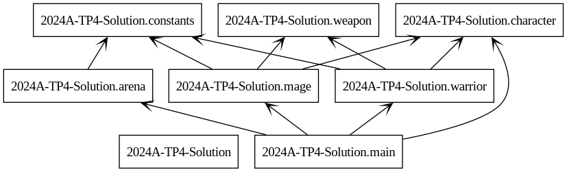
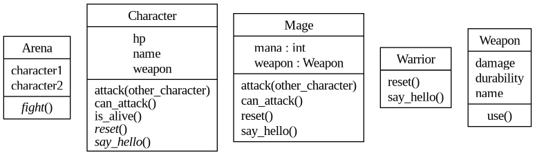
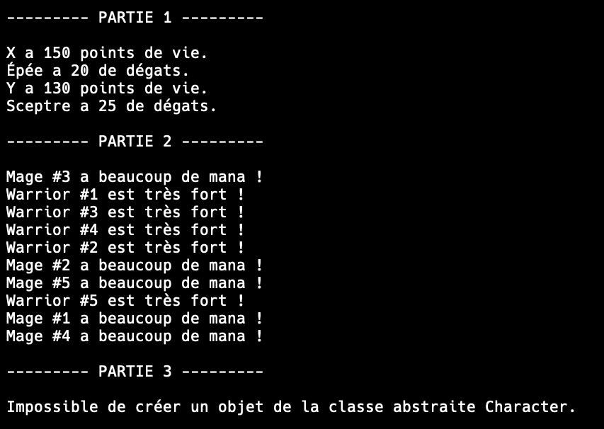
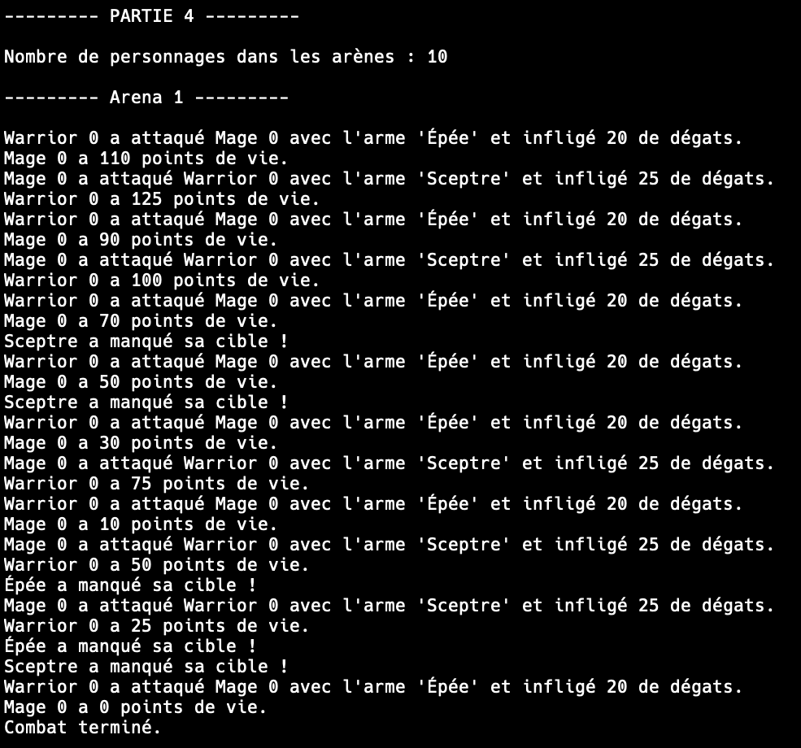

# TP4 : Simulation de combats entre différents personnages

## Directives
:alarm_clock: **Date de remise** : 1 décembre 2024 à 23h59

:mailbox_with_mail: **À remettre sur** : GitHub

## Introduction
Ce travail pratique vise à développer un système de simulation de combats entre différents types de personnages dans un jeu. Vous allez implémenter plusieurs classes en Python qui modélisent des personnages, des armes et des arènes de combat. Chaque personnage possède des caractéristiques et des compétences spécifiques, et peut effectuer diverses actions comme attaquer ou utiliser des objets. Ce projet mettra en œuvre des concepts fondamentaux de la programmation orientée objet, tels que l'héritage, le polymorphisme, les classes abstraites et l'encapsulation.

## Objectifs d'apprentissage

- Comprendre et appliquer les concepts de l'héritage et du polymorphisme en programmation orientée objet.
- Utiliser des classes et des méthodes abstraites.
- Gérer des attributs et des méthodes statiques.
- Implémenter des méthodes spéciales comme les constructeurs, destructeurs et surcharges d'opérateurs.
- Gérer les exceptions en Python.

## Instructions

Vous devez compléter les fichiers fournis en implémentant les méthodes manquantes selon les indications. Les parties à compléter sont marquées avec des commentaires `# TODO`.

Les différentes classes de ce travail intéragissent entre elles, il n'est donc pas possible de compléter les fichiers dans un par un. Il faudra donc essayer de naviguer dans les différents fichiers et les remplir petit à petit.

Voici deux diagrammes qui pourraient vous aider pour ce travail :

#### Diagramme de dépendances

#### Diagramme de classes

### Détails des parties :

#### Partie 1 : Création des personnages

- **Tâche** : Instancier un guerrier (`Warrior`) et un mage (`Mage`), puis les afficher ainsi que leur arme respective.

#### Partie 2 : Polymorphisme

- **Tâche** : Créer une liste de 10 personnages (5 guerriers et 5 mages), mélanger aléatoirement la liste, puis afficher leur message personnalisé en utilisant la méthode `say_hello`.

#### Partie 3 : Gestion d'erreurs

- **Tâche** : Utiliser un bloc `try/except` pour gérer l'instanciation d'un objet de la classe abstraite `Character` et afficher un message d'erreur approprié.

#### Partie 4 : Simulation de combats

- **Tâche** : 
  - Instancier 5 arènes (`Arena`) avec 2 personnages chacune.
  - Simuler les combats en utilisant la méthode `fight`.
  - Afficher le nombre total de personnages dans les arènes en utilisant la méthode statique `get_players_count`.

### Détails des fichiers :

- **`main.py`**  
  Le fichier principal du TP. C'est le seul fichier qui doit être exécuté.

- **`character.py`**  
  Contient la classe abstraite `Character`, qui définit les méthodes et attributs communs à tous les personnages.

- **`warrior.py`**  
  Contient la classe `Warrior`, qui hérite de `Character`.

- **`mage.py`**  
  Contient la classe `Mage`, qui hérite de `Character`.
  Cette classe contient un attribut de plus 'mana'.

- **`weapon.py`**  
  Contient la classe `Weapon`, qui représente les armes utilisées par les personnages.

- **`arena.py`**  
  Contient la classe `Arena`, qui gère les combats entre les personnages.

- **`constants.py`**  
  Contient les constantes utilisées dans le programme.
  Ce fichier n'a pas besoin être modifié.

### Exemple d'exécution :

#### Partie 1, 2, 3 :

#### Partie 4 :

- Cette image montre seulement le premier des cinq combats par souci d'espace.

### Remise du travail

- **Dépôt GitHub** : Poussez votre code sur votre dépôt GitHub généré par GitHub Classroom.
- **Qualité du code** : Assurez-vous que votre code est bien commenté et respecte les conventions de nommage.

## Barème de correction

| Tâche                                                  | Points |
|--------------------------------------------------------|--------|
| **Implémentation de la classe `Warrior`**              |   2    |
| **Implémentation de la classe `Mage`**                 |   3    |
| **Implémentation de la classe `Weapon`**               |   3    |
| **Implémentation de la classe `Character`**            |   4    |
| **Implémentation de la classe `Arena`**                |   4    |
| **Implémentation du main**                             |   4    |
|                                                        |**Total**|
|                                                        | **20** |

## Conseils

- **Lecture attentive** : Lisez attentivement les commentaires `# TODO` dans le code pour comprendre ce qui est attendu.
- **Compréhension** : Assurez-vous de bien comprendre le fonctionnement de chaque classe et de leurs relations.
- **Bonne pratique** : Respectez les conventions de codage Python et documentez votre code.

## Références

- [Documentation officielle de Python](https://docs.python.org/3/)
- [Guide du style Python (PEP 8)](https://www.python.org/dev/peps/pep-0008/)
- [Programmation orientée objet en Python](https://docs.python.org/3/tutorial/classes.html)

---